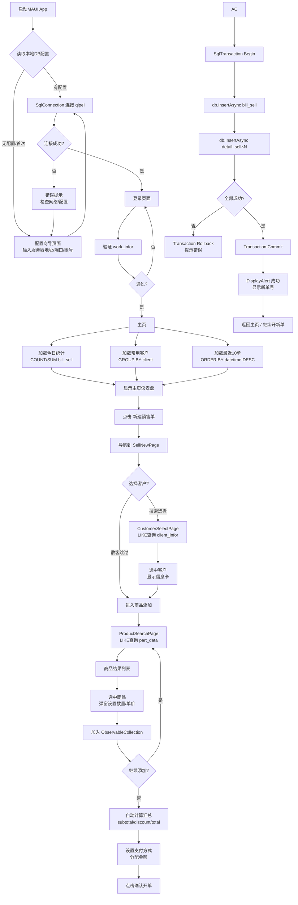

# QP11 销售开单App - 产品需求文档 (MAUI跨平台版)

## 1. 产品概述

基于 **QP11汽配管理系统现有数据库(qipei)** 的 **.NET MAUI 跨平台移动应用**，专注于**快速、高效地完成销售开单流程**。使用 **C#** 开发，可同时运行在 **Android / iOS / Windows** 三个平台。通过 `Microsoft.Data.SqlClient` 直连现有 SQL Server 数据库，与QP11主系统共享数据，实现**代码复用最大化、数据零迁移**。

**核心优势**: 
- 复用 QP11 现有的 **C# 实体类** (`BillSell`, `DetailSell`, `PartData`, `ClientInfor`)
- 复用 **Dapper ORM** 和 SQL Server 访问经验
- 一套代码 → Android手机 + iOS平板 + Windows桌面
- 直连 `qipei` 数据库，无需中间服务

## 2. 核心功能

### 2.1 用户角色

| 角色 | 认证方式 | 核心权限 |
|------|----------|----------|
| 销售员/开单员 | 账号密码登录(查work_infor表) | 开单、查看历史单据、客户/商品查询 |
| 管理员 | 账号密码登录 | 全部功能 + 单据作废 |

### 2.2 功能模块

1. **登录页**: 连接数据库验证身份，显示连接状态
2. **主页仪表盘**: 快速新建销售单、今日统计、常用客户快捷入口
3. **销售开单(核心)**: 完整开单 - 选客户→加商品→调价格→设折扣→选支付方式→提交入库
4. **商品搜索**: 按零件号/名称/拼音搜索 `part_data` 表，支持扫码
5. **客户选择**: 搜索/选择 `client_infor` 表中的客户
6. **历史单据**: 查询 `bill_sell` + `detail_sell` 已有单据
7. **个人中心**: 当前用户信息、数据库连接状态、系统设置

### 2.3 页面详情

| 页面名称 | 模块名称 | 功能描述 | 数据来源 |
|-----------|-------------|---------------------|----------|
| 登录页 | 认证表单 | 用户名+密码输入,连接数据库验证,服务器地址配置 | `work_infor` 表 |
| 主页 | 头部区域 | 显示当前登录用户、当前日期时间、DB连接状态指示 | 内存状态 |
| 主页 | 新建按钮 | 大按钮「+ 新建销售单」(醒目卡片样式) | 触发导航 |
| 主页 | 今日统计 | 今日开单数、今日销售额、今日收款额 (3个统计卡片) | 聚合查询 `bill_sell` |
| 主页 | 常用客户 | 最近交易过的5个客户 (横向可滑动标签) | `bill_sell GROUP BY client` |
| 主页 | 最近单据 | 最近10条销售单列表预览 (下拉刷新) | `bill_sell ORDER BY datetime DESC` |
| 销售开单页 | 客户选择区 | 点击搜索/选择客户,显示名称/电话/信用额度,支持「散客」 | 读 `client_infor` |
| 销售开单页 | 商品明细表 | CollectionView: 商品图/名称/编号/数量/单价/小计/左滑删除 | 内存 + `part_data` |
| 销售开单页 | 商品添加入口 | 「扫码」按钮 + 「搜索商品」按钮 → 导航到搜索页 | 查询 `part_data` |
| 销售开单页 | 金额汇总区 | 商品总额、整单折扣率(Slider)、折后金额、运费 | 内存计算 |
| 销售开单页 | 收款结算区 | 应收金额、支付方式(现金/微信/支付宝/欠款等)、各方式金额输入 | 写入 `bill_sell` |
| 销售开单页 | 操作栏 | 「保存草稿」「确认开单」→ 事务写入DB | INSERT `bill_sell` + `detail_sell` |
| 商品搜索页 | 搜索栏 | 输入关键词(零件号/名称/拼音), 实时防抖搜索 | LIKE 查询 `part_data` |
| 商品搜索页 | 结果列表 | 显示匹配商品: 图片/编号/名称/车型/零售价/批发价/库存位 | 查询 `part_data` |
| 商品搜索页 | 确认添加 | 选择商品后弹出Sheet设置数量和单价,加入明细 | 内存 |
| 历史单据页 | 筛选条件 | 日期范围Picker、客户搜索框、单号模糊搜索 | WHERE 条件 |
| 历史单据页 | 单据列表 | 卡片式: 单号/客户名/金额/状态标签/时间 | 查询 `bill_sell` |
| 单据详情页 | 单据头信息 | 客户/业务员/折扣率/各支付方式金额/备注 | 读 `bill_sell` |
| 单据详情页 | 明细列表 | 各商品的图片/编号/名称/数量/单价/小计 (分组展示) | 读 `detail_sell LEFT JOIN part_data` |

## 3. 核心流程

### 3.1 销售开单主流程 (数据流向)

```
┌──────────────────────────────────────────────────────────────────┐
│                        App 启动                                   │
│  [初始化MAUI] → [读取本地配置] → [SqlConnection连接qipei数据库]     │
│              ↓                                                    │
│     ┌───────┴────────┐                                           │
│     │ 连接成功?       │                                           │
│     ├─是→ [登录页面]  │                                           │
│     └─否→ [配置页面]  │ ← 手动输入服务器地址/端口/用户名/密码        │
│              ↓                                                    │
│   [输入账号密码] → [SELECT work_infor 验证] → [进入主页]           │
└──────────────────────────────────────────────────────────────────┘
                              ↓
┌──────────────────────────────────────────────────────────────────┐
│                         主页                                      │
│  [加载今日统计: COUNT/SUM bill_sell WHERE 今天]                    │
│  [加载常用客户: TOP 5 client FROM bill_sell GROUP BY 时间]         │
│  [加载最近10单: TOP 10 FROM bill_sell ORDER BY datetime DESC]      │
│                              ↓                                    │
│                  点击 [+ 新建销售单]                               │
└──────────────────────────────────────────────────────────────────┘
                              ↓
┌──────────────────────────────────────────────────────────────────┐
│                      开单页面                                     │
│                                                                   │
│  ┌─────────────────────────────────────────────────────┐         │
│  │ 📇 客户: [点击选择客户/散客]    张三汽配  138xxxx     │  ←client_infor│
│  ├─────────────────────────────────────────────────────┤         │
│  │ 🔍 [扫码]  [搜索商品]                                │         │
│  ├─────────────────────────────────────────────────────┤         │
│  │ 📦 商品明细                                          │         │
│  │  ┌────────────────────────────────────┬──────┐      │         │
│  │  │ 刹车片 BPW-001          ×2  ¥15.00 │ ¥30  │ ✕  │  ←part_data│
│  │  │ 机油滤清器 OF-220       ×5  ¥25.00 │ ¥125 │ ✕  │         │
│  │  │ 火花塞 NGK-BPR6ES       ×4  ¥35.00 │ ¥140 │ ✕  │         │
│  │  └────────────────────────────────────┴──────┘      │         │
│  │  [ + 添加更多商品 ]                                │         │
│  ├─────────────────────────────────────────────────────┤         │
│  │ 💰  商品合计:      ¥295.00                          │         │
│  │     折扣:          95%                      [===]  │         │
│  │     折后金额:      ¥280.25                          │         │
│  │     运费:          ¥10.00                           │         │
│  │     ─────────────────────────────                   │         │
│  │     应收金额:      ¥290.25                          │         │
│  ├─────────────────────────────────────────────────────┤         │
│  │ 💳 收款                                             │         │
│  │  [现金] [微信] [支付宝] [欠款]                       │         │
│  │  现金: [____200__]  微信: [____90.25_]              │         │
│  │  已收: ¥290.25   余额: ¥0.00                        │         │
│  ├─────────────────────────────────────────────────────┤         │
│  │      [保存草稿]              [✓ 确认开单]            │         │
│  └─────────────────────────────────────────────────────┘         │
│                                                                   │
│  确认开单 → BEGIN TRANSACTION                                     │
│           → INSERT INTO bill_sell (...)                           │
│           → 循环 INSERT INTO detail_sell (...)                    │
│           → COMMIT                                                │
│           → 弹出成功提示 "单号: XS20260602xxxxx"                   │
│           → 返回主页                                              │
└──────────────────────────────────────────────────────────────────┘
```



## 4. 用户界面设计

### 4.1 设计风格 (MAUI/XAML)

- **主色调**: `#2563EB` (专业蓝) - Primary Button / Active Tab
- **辅助色**: `#059669` 成功绿 / `#DC2626` 删除警告红 / `#F59E0B` 强调橙
- **背景色**: `#F8FAFC` 页面底色 / `#FFFFFF` 卡片底色
- **文字色**: `#1E293B` 主文字 / `#64748B` 次要文字 / `#94A3B8` 占位符
- **圆角**: 卡片 `12px` 按钮 `8px` 输入框 `8px`
- **阴影**: 卡片轻微阴影 `0 2 8 rgba(0,0,0,0.06)`
- **字体**: 平台默认字体 (Android: Roboto / iOS: SF / Windows: Segoe UI)
- **图标**: 使用 MAUI 图形或 FontImageSource (Material Symbols 风格)

### 4.2 关键页面布局说明

#### 登录页 (LoginPage)
- 垂直居中布局
- 顶部: Logo图标 + "QP11 销售开单" 标题
- 中部: 服务器地址输入框(可折叠高级设置) + 用户名 + 密码
- 底部: 「连接并登录」按钮 + 版本信息 + DB连接状态点状指示灯

#### 主页 (HomePage) - Shell Flyout 或 TabBar 方式
- **顶部Navigation Bar**: 标题 + 右侧DB状态图标(绿点=已连接/红点=断开)
- **RefreshView包裹整体内容**: 下拉刷新数据
- **新建按钮区**: 大尺寸Card, 渐变蓝底, 白色"+ 新建销售单"文字, 阴影效果
- **统计卡片区**: Horizontal ScrollView / FlexLayout 3列等宽:
  - Card1: "📦 今日订单" + 大号数字
  - Card2: "💰 销售额" + 大号数字(红色)
  - Card3: "💵 收款额" + 大号数字(绿色)
- **常用客户区**: Label "常用客户" + Horizontal ScrollView(Chip/Tag样式, 可点击快速创建该客户的订单)
- **最近单据区**: Label "最近单据" + CollectionView(每行: 单号 | 客户简称 | 金额 | 相对时间)
- **底部TabBar**: 首页 / 单据 / 设置

#### 销售开单页 (SellNewPage) - 最重要页面
- **Toolbar**: "< 返回" + "新建销售单"
- **客户选择Card**(可点击展开):
  ```
  👤 客户
  ┌──────────────────────────────────────┐
  │ 📇 张三汽配                    📱 138****8888  │
  │    信用额度: ¥50,000.00                             │
  │                                        [更换 ▶]  │
  └──────────────────────────────────────┘
  ```
- **操作按钮行**: `[📷 扫码]` `[🔍 搜索商品]`
- **商品明细CollectionView**:
  - 每行是一个水平Card: 左侧商品名+编号 | 数量Stepper | 单价Entry | 小计Label | 删除Button
  - 空状态: "+ 点击上方按钮添加商品"
  - 底部合计小条: "共 N 件商品"
- **金额汇总Frame**(浅灰底, 圆角):
  ```
  ┌────────────────────────────────────┐
  │  商品合计          ¥ xxx.xx  →右对齐 │
  │  整体折扣    95%   =========[===]   │  ←Slider控件
  │  折后金额          ¥ xxx.xx        │
  │  运费              ¥ xx.xx   [📝]  │
  │  ───────────────────────────       │
  │  应收金额          ¥ xxx.xx        │  ←加粗加大
  └────────────────────────────────────┘
  ```
- **收款面板**(Tabbed模式或Radio按钮组):
  - 支付方式选项: 💵现金 | 💚微信 | 💙支付宝 | 🎫刷卡 | 📝欠款
  - 各方式金额 Entry (数字键盘)
  - 实时计算: "已收: ¥xxx.xx | 未收: ¥xxx.xx"
- **底部固定按钮栏**: `[保存草稿]`(灰色) ... `[确认开单]`(蓝色, 填充宽度)

#### 商品搜索页 (ProductSearchPage)
- **顶部SearchBar**: 固定, 占位符 "搜索零件号/名称/拼音", 带搜索图标和清除按钮
- **筛选条件行**(可选): 分类Picker + 车型Picker
- **商品CollectionView**(瀑布流/网格布局):
  - 每个商品Card: 上方图片占位(或首字母头像) | 编号(等宽灰底) | 名称(加粗) | 车型(次要) | 零售价(红大字) | 批发价(灰)
- **点击商品**: 弹出半屏Modal(BottomSheet): 显示完整信息 + 数量Stepper + 单价Entry + 「加入开单」按钮

#### 单据详情页 (OrderDetailPage)
- **只读展示**, 信息分段:
  - 单据头: 单号(可复制) | 客户 | 业务员 | 开单时间 | 折扣率
  - 金额汇总: 合计/折扣/折后/运费/应收
  - 支付明细: 各方式金额
  - 明细列表: 同开单页的商品列表样式(只读, 无删除编辑)
  - 备注(如有)

### 4.3 多平台适配策略

| 平台 | 目标设备 | 特殊处理 |
|------|---------|---------|
| **Android** | 手机(竖屏为主) | 底部安全区适配(Material3风格) |
| **iOS** | iPhone/iPad | 刘海适配/SafeArea / iPad分栏布局 |
| **Windows** | 桌面窗口 | 更大尺寸(800x600起), 鼠标键盘优化 |

## 5. 与现有系统的关系

### 5.1 数据共享原则

| 说明 | 详情 |
|------|------|
| 数据库 | **直接共用** QP11 的 `qipei` 数据库，不创建新库 |
| 数据表 | **直接读写** 现有表结构，不修改表定义 |
| 代码复用 | **复用** QP11.Core.Entities 下所有实体类 |
| ORM | **复用** Dapper + 现有SQL语句风格 |
| 单号规则 | 使用 `XS` 前缀区分来源 (如 `XS20260602143025001`) |
| 并发安全 | 通过 SqlTransaction 保证 ACID |

### 5.2 可复用的现有代码资产

| 来自QP11的资产 | 复用方式 |
|---------------|---------|
| `QP11.Core.Entities.BillSell` | 直接引用或拷贝实体类 |
| `QP11.Core.Entities.DetailSell` | 直接引用或拷贝实体类 |
| `QP11.Core.Entities.PartData` | 直接引用或拷贝实体类 |
| `QP11.Core.Entities.ClientInfor` | 直接引用或拷贝实体类 |
| `SellRepository.cs` 的SQL语句 | 参考其CRUD SQL逻辑 |
| `appsettings.json` 的连接字符串 | 复用连接参数格式 |
| DatabaseFactory 连接管理模式 | 参考(但改用SqlConnection) |

### 5.3 读取的数据表

| 表名 | 用途 | 读取字段 |
|------|------|----------|
| `part_data` | 商品搜索/展示 | partid, partno, name, unit, lsprice, pfprice, carname, cartype, place, class_ |
| `client_infor` | 客户选择/展示 | cid, name, mobile, tel, credit, level, address |
| `work_infor` | 用户登录验证 | workid, name |
| `bill_sell` | 历史单据查询/统计 | sn, client, total, discount_rate, total_payment, datetime, flag, worker |
| `detail_sell` | 单据明细查看 | sn, partid, partno, name, amount, price, btotal |

### 5.4 写入的数据表

| 表名 | 操作 | 写入字段 |
|------|------|----------|
| `bill_sell` | INSERT (新增开单) | sn, client, worker, operator, total, bill_total, discount_rate, total_payment, bill_payment, cash, weixin, zhifubao, collection, checks, arrear, yunfei, memo, flag=0, datetime=GETDATE() |
| `detail_sell` | INSERT BATCH (商品明细) | sn, partid, partno, name, unit, place, amount, price, bill_price, stotal, btotal, cartype, car_mark, memo, datetime=GETDATE() |
| `bill_sell` | UPDATE (逻辑作废) | SET flag=-1 WHERE sn=@sn |

### 5.5 不涉及的功能 (不在本App范围内)

- 进货管理 (`bill_buy`)
- 库存管理 (出入库调整)
- 财务对账/报表
- 会员管理/积分
- 系统管理(用户增删改)
- 数据导入导出
