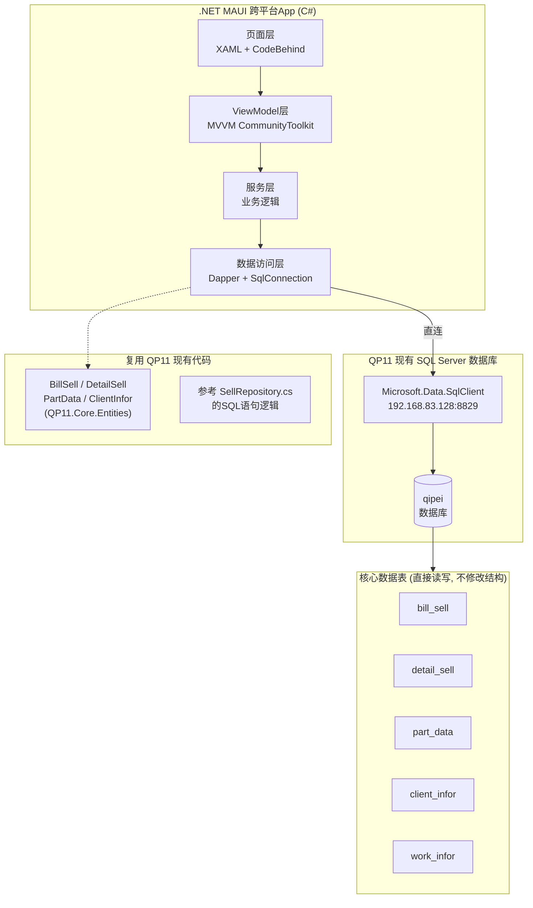
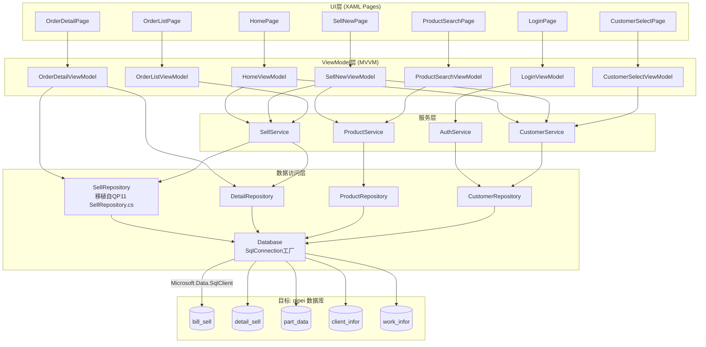

# QP11 销售开单App - 技术架构文档 (MAUI/C# + 直连现有数据库)

## 1. 架构设计



## 2. 现有数据库环境

### 2.1 连接配置 (来自 QP11 appsettings.json)

| 配置项 | 值 |
|--------|-----|
| **数据库** | Microsoft SQL Server (`qipei`) |
| **服务器** | `192.168.83.128,8829` |
| **ODBC DSN** | `qipei` (QP11主系统使用) |
| **登录** | `sa` / `593106` |

### 2.2 MAUI 连接方式: Microsoft.Data.SqlClient

> **关键**: MAUI Android/iOS 原生不支持 ODBC，但 **Microsoft.Data.SqlClient** 完全支持在 MAUI 中使用，可直连 SQL Server！

```csharp
// MAUI 中的连接字符串 (无需ODBC)
var connStr = "Server=192.168.83.128,8829;Database=qipei;" +
              "User Id=sa;Password=593106;" +
              "TrustServerCertificate=True;" +     // 开发环境信任证书
              "Connect Timeout=10;";
```

### 2.3 涉及的数据库表

| 表名 | 主键 | 操作 | 对应QP11实体类 |
|------|------|------|---------------|
| `bill_sell` | `sn` (varchar) | SELECT / INSERT / UPDATE | [BillSell.cs](src/QP11.Core/Entities/BillSell.cs) |
| `detail_sell` | `id` (bigint identity) | SELECT / INSERT | [DetailSell.cs](src/QP11.Core/Entities/DetailSell.cs) |
| `part_data` | `partid` (bigint) | SELECT (只读) | [PartData.cs](src/QP11.Core/Entities/PartData.cs) |
| `client_infor` | `cid` (varchar) | SELECT (只读) | [ClientInfor.cs](src/QP11.Core/Entities/ClientInfor.cs) |
| `work_infor` | - | SELECT (只读验证) | - |

## 3. 技术选型

### 3.1 技术栈总览

| 层级 | 技术 | 版本 | 用途 |
|------|------|------|------|
| 语言/框架 | C# / .NET 8 | 8.0 | 全部代码 |
| UI框架 | .NET MAUI | 8.0 | 跨平台界面(XAML) |
| MVVM工具包 | CommunityToolkit.Mvvm | 8.2+ | ObservableObject / RelayCommand / 属性通知 |
| ORM | Dapper | 2.1+ | 轻量SQL映射 (与QP11一致) |
| 数据库驱动 | Microsoft.Data.SqlClient | 5.x | SQL Server连接 (MAUI兼容) |
| 依赖注入 | Microsoft.Extensions.DependencyInjection | 8.0 | IoC容器 |
| 配置 | Microsoft.Extensions.Configuration | 8.0 | JSON配置管理 |
| 序列化 | System.Text.Json | 8.0 | 本地缓存序列化 |
| 扫码(可选) | ZXing.Net.MAUI | 最新版 | 条形码/二维码扫描 |

### 3.2 为什么选择这个技术栈

**MAUI 的优势**:
- 微软官方跨平台框架，长期维护保障
- C# 开发，与现有 QP11 项目**同语言、同生态**
- 可直接引用或拷贝 QP11.Core.Entities 的实体类
- XAML 热重载，开发效率高
- 单套代码编译为 Android APK / iOS IPA / Windows EXE

**Dapper 的优势**:
- 与 QP11 主系统**完全相同的ORM**
- 零配置、高性能、原生SQL控制
- 已有的 [SellRepository.cs](src/QP11.Data\Repositories/SellRepository.cs) SQL语句可直接移植

**Microsoft.Data.SqlClient 在 MAUI 中的可行性**:
- ✅ 官方支持 .NET 8 (含 MAUI)
- ✅ 支持 TLS 加密连接
- ✅ 支持 SqlTransaction 事务
- ✅ Android/iOS/Windows 三平台统一 API
- ⚠️ 需要局域网访问或公网IP

## 4. 项目结构

```
Qp11.SellApp/                          # 解决方案根目录
├── Qp11.SellApp/                      # MAUI 项目 (主项目)
│   ├── App.xaml / App.xaml.cs         # 应用入口, 注册服务
│   ├── AppShell.xaml                  # Shell 导航 (TabBar/Flyout)
│   ├── MauiProgram.cs                 # MAUI初始化 + DI注册
│   │
│   ├── Resources/                     # 平台资源
│   │   ├── AppIcon/
│   │   ├── Splash/
│   │   ├── Fonts/
│   │   └── Raw/                       # 嵌入式资源(JSON配置等)
│   │
│   ├── Pages/                         # 页面 (XAML + CodeBehind)
│   │   ├── LoginPage.xaml/cs          # 登录页
│   │   ├── HomePage.xaml/cs           # 主页仪表盘
│   │   ├── SellNewPage.xaml/cs        # 销售开单页 (核心!)
│   │   ├── ProductSearchPage.xaml/cs  # 商品搜索页
│   │   ├── CustomerSelectPage.xaml/cs # 客户选择页
│   │   ├── OrderListPage.xaml/cs      # 历史单据列表
│   │   ├── OrderDetailPage.xaml/cs    # 单据详情
│   │   └── SettingsPage.xaml/cs       # 设置页
│   │
│   ├── ViewModels/                    # MVVM ViewModel层
│   │   ├── BaseViewModel.cs           # 基类 (ObservableObject)
│   │   ├── LoginViewModel.cs
│   │   ├── HomeViewModel.cs
│   │   ├── SellNewViewModel.cs        # ★ 最核心VM
│   │   ├── ProductSearchViewModel.cs
│   │   ├── CustomerSelectViewModel.cs
│   │   ├── OrderListViewModel.cs
│   │   └── OrderDetailViewModel.cs
│   │
│   ├── Controls/                      # 自定义控件
│   │   ├── StatCard.xaml/cs           # 统计卡片
│   │   ├── CustomerInfoCard.xaml/cs   # 客户信息卡
│   │   ├── SellItemRow.xaml/cs        # 商品明细行
│   │   ├── SummaryBar.xaml/cs         # 金额汇总栏
│   │   └── PaymentPanel.xaml/cs       # 收款面板
│   │
│   ├── Models/                        # 数据模型 (从QP11复用/适配)
│   │   ├── Entities/                  # ← 直接来自 QP11.Core.Entities
│   │   │   ├── BillSell.cs            # (复制自QP11,微调)
│   │   │   ├── DetailSell.cs
│   │   │   ├── PartData.cs
│   │   │   └── ClientInfor.cs
│   │   ├── SellContext.cs             # 开单运行时上下文
│   │   ├── TodayStats.cs              # 今日统计DTO
│   │   └── AppConfig.cs               # App配置模型
│   │
│   ├── Services/                      # 业务服务层
│   │   ├── ISellService.cs            # 接口定义
│   │   ├── SellService.cs             # 开单事务核心逻辑
│   │   ├── IProductService.cs
│   │   ├── ProductService.cs
│   │   ├── ICustomerService.cs
│   │   ├── CustomerService.cs
│   │   ├── IAuthService.cs
│   │   └── AuthService.cs
│   │
│   ├── Data/                          # 数据访问层
│   │   ├── Database.cs                # SqlConnection 工厂
│   │   ├── ISellRepository.cs
│   │   ├── SellRepository.cs          # bill_sell CRUD (移植自QP11)
│   │   ├── IDetailRepository.cs
│   │   ├── DetailRepository.cs        # detail_sell CRUD
│   │   ├── IProductRepository.cs
│   │   ├── ProductRepository.cs       # part_data 查询
│   │   ├── ICustomerRepository.cs
│   │   └── CustomerRepository.cs      # client_infor 查询
│   │
│   └── Helpers/                       # 工具类
│       ├── MoneyFormatter.cs          # 金额格式化
│       ├── SnGenerator.cs             # 单号生成器
│       ├── Validator.cs               # 输入校验
│       └── PreferencesHelper.cs        # 本地偏好存储
│
├── Qp11.SellApp.Core/                 # 共享库 (可选, 放实体和接口)
│   ├── Entities/                      # 实体类 (可与QP11共享NuGet)
│   └── Interfaces/
│
├── Qp11.SellApp.sln                   # 解决方案文件
├── Directory.Build.props              # 共享构建属性
└── README.md
```

## 5. 路由/导航定义

| 路由 | Page类型 | 说明 |
|------|----------|------|
| `//login` | LoginPage | 登录认证 |
| `//home` | HomePage | 主页仪表盘 |
| `//sell/new` | SellNewPage | 新建销售单 |
| `//sell/edit?sn=xxx` | SellNewPage | 编辑已有销售单 |
| `//products/search` | ProductSearchPage | 商品搜索 |
| `//customers/select` | CustomerSelectPage | 客户选择 |
| `//orders` | OrderListPage | 历史单据列表 |
| `//orders/detail?sn=xxx` | OrderDetailPage | 单据详情 |
| `//settings` | SettingsPage | 设置 |

## 6. 核心代码实现

### 6.1 数据库连接管理

```csharp
// ====== Data/Database.cs ======
using Microsoft.Data.SqlClient;

namespace Qp11.SellApp.Data;

public class Database
{
    private readonly string _connStr;
    
    public Database(string connectionString)
    {
        _connStr = connectionString;
    }
    
    public SqlConnection CreateConnection()
    {
        var conn = new SqlConnection(_connStr);
        return conn;
    }
    
    public async Task<T> ExecuteAsync<T>(Func<SqlConnection, SqlTransaction?, Task<T>> action)
    {
        using var conn = CreateConnection();
        await conn.OpenAsync();
        return await action(conn, null);
    }
    
    public async Task<T> InTransactionAsync<T>(Func<SqlConnection, SqlTransaction, Task<T>> action)
    {
        using var conn = CreateConnection();
        await conn.OpenAsync();
        using var txn = conn.BeginTransaction();
        try
        {
            var result = await action(conn, txn);
            await txn.CommitAsync();
            return result;
        }
        catch
        {
            await txn.RollbackAsync();
            throw;
        }
    }
}
```

### 6.2 SellRepository (移植自 QP11 SellRepository.cs)

```csharp
// ====== Data/SellRepository.cs ======
using Dapper;
using Microsoft.Data.SqlClient;
using Qp11.SellApp.Models.Entities;

namespace Qp11.SellApp.Data;

public interface ISellRepository
{
    Task<BillSell?> GetBySnAsync(string sn);
    Task<IEnumerable<BillSell>> GetListAsync(DateTime? startDate, DateTime? endDate, string? client);
    Task<int> InsertBillAsync(SqlConnection conn, SqlTransaction? txn, BillSell bill);
    Task<int> UpdateBillAsync(SqlConnection conn, BillSell bill);
    Task<int> VoidBillAsync(SqlConnection conn, string sn);
    Task<TodayStats> GetTodayStatsAsync(SqlConnection conn);
    Task<IEnumerable<BillSell>> GetRecentAsync(SqlConnection conn, int limit);
}

public class SellRepository : ISellRepository
{
    // SQL语句直接参考 QP11.Data.Repositories.SellRepository.cs
    
    public async Task<BillSell?> GetBySnAsync(string sn, SqlConnection conn, SqlTransaction? txn = null)
    {
        var sql = "SELECT * FROM bill_sell WHERE sn = @Sn";
        return await conn.QueryFirstOrDefaultAsync<BillSell>(sql,
            new { Sn = sn }, transaction: txn);
    }

    public async Task<IEnumerable<BillSell>> GetListAsync(
        DateTime? startDate, DateTime? endDate, string? client,
        SqlConnection conn, SqlTransaction? txn = null)
    {
        var sql = @"SELECT * FROM bill_sell WHERE ISNULL(flag,0) != -1";
        if (startDate.HasValue) sql += " AND datetime >= @Start";
        if (endDate.HasValue) sql += " AND datetime < DATEADD(day, 1, @End)";
        if (!string.IsNullOrEmpty(client)) sql += " AND client = @Client";
        sql += " ORDER BY datetime DESC";
        
        return await conn.QueryAsync<BillSell>(sql,
            new { Start = startDate, End = endDate, Client = client },
            transaction: txn);
    }

    public async Task<int> InsertBillAsync(SqlConnection conn, SqlTransaction? txn, BillSell bill)
    {
        var sql = @"INSERT INTO bill_sell 
            (sn, client, worker, [operator], checkno, total, bill_total, discount_rate,
             total_payment, bill_payment, cash, collection, weixin, zhifubao, checks, yunfei, arrear, flag, datetime, memo)
            VALUES (@Sn, @Client, @Worker, @Operator, @Checkno, @Total, @BillTotal, @DiscountRate,
             @TotalPayment, @BillPayment, @Cash, @Collection, @Weixin, @Zhifubao, @Checks, @Yunfei, @Arrear, @Flag, GETDATE(), @Memo)";
        
        return await conn.ExecuteAsync(sql, bill, transaction: txn);
    }

    public async Task<TodayStats> GetTodayStatsAsync(SqlConnection conn)
    {
        var sql = @"SELECT 
            COUNT(*) AS OrderCount,
            COALESCE(SUM(total),0) AS TotalAmount,
            COALESCE(SUM(bill_payment),0) AS PaymentAmount
            FROM bill_sell 
            WHERE ISNULL(flag,0) != -1
            AND CONVERT(date,datetime) = CONVERT(date,GETDATE())";
        
        return await conn.QueryFirstOrDefaultAsync<TodayStats>(sql);
    }
}
```

### 6.3 DetailRepository

```csharp
// ====== Data/DetailRepository.cs ======
public interface IDetailRepository
{
    Task<IEnumerable<DetailSell>> GetDetailsAsync(string sn, SqlConnection conn, SqlTransaction? txn = null);
    Task<int> InsertDetailAsync(SqlConnection conn, SqlTransaction? txn, DetailSell detail);
    Task<int> InsertDetailsAsync(SqlConnection conn, SqlTransaction? txn, IEnumerable<DetailSell> details);
}

public class DetailRepository : IDetailRepository
{
    public async Task<int> InsertDetailsAsync(
        SqlConnection conn, SqlTransaction? txn, IEnumerable<DetailSell> details)
    {
        var sql = @"INSERT INTO detail_sell 
            (sn, partid, partno, name, unit, place, amount, price, bill_price,
             stotal, btotal, cartype, car_mark, memo, datetime)
            VALUES (@Sn, @Partid, @Partno, @Name, @Unit, @Place, @Amount, @Price, @BillPrice,
             @Stotal, @Btotal, @Cartype, @CarMark, @Memo, GETDATE())";
        
        return await conn.ExecuteAsync(sql, details, transaction: txn);
    }
}
```

### 6.4 核心服务: 开单事务 (SellService)

```csharp
// ====== Services/SellService.cs ======
namespace Qp11.SellApp.Services;

public interface ISellService
{
    Task<string> CreateSellAsync(SellContext ctx);
    Task<bool> UpdateSellAsync(BillSell bill);
    Task<bool> VoidSellAsync(string sn);
}

public class SellService : ISellService
{
    private readonly Database _db;
    private readonly ISellRepository _sellRepo;
    private readonly IDetailRepository _detailRepo;
    
    public SellService(Database db, ISellRepository sellRepo, IDetailRepository detailRepo)
    {
        _db = db;
        _sellRepo = sellRepo;
        _detailRepo = detailRepo;
    }
    
    /*
     * 创建销售单 - 核心事务流程
     * 与 QP11 SellRepository.InsertBillAsync + InsertDetailsAsync 的事务模式一致
     */
    public async Task<string> CreateSellAsync(SellContext ctx)
    {
        return await _db.InTransactionAsync(async (conn, txn) =>
        {
            // 1. 生成单号
            var sn = SnGenerator.Generate();
            ctx.Bill.Sn = sn;
            
            // 2. 填充业务字段
            ctx.Bill.Worker = ctx.CurrentUserId;
            ctx.Bill.Operator_ = ctx.CurrentUserName;
            ctx.Bill.Flag = 0;
            
            // 3. 计算金额
            CalculateTotals(ctx);
            
            // 4. 写入主表 bill_sell
            var rows = await _sellRepo.InsertBillAsync(conn, txn, ctx.Bill);
            if (rows <= 0) throw new Exception("写入bill_sell失败");
            
            // 5. 批量写入明细 detail_sell
            foreach (var d in ctx.Details)
            {
                d.Sn = sn;
            }
            var inserted = await _detailRepo.InsertDetailsAsync(conn, txn, ctx.Details);
            if (inserted != ctx.Details.Count) throw new Exception("写入detail_sell不完整");
            
            return sn;
        });
    }
    
    private void CalculateTotals(SellContext ctx)
    {
        ctx.Bill.Total = ctx.Details.Sum(d => d.Stotal);
        ctx.Bill.BillTotal = ctx.Bill.Total * ctx.Bill.DiscountRate;
        ctx.Bill.Yunfei = ctx.Yunfei;
        ctx.Bill.TotalPayment = ctx.Bill.BillTotal + ctx.Bill.Yunfei;
        
        ctx.Bill.Cash = ctx.Payments[PayType.Cash];
        ctx.Bill.Weixin = ctx.Payments[PayType.Weixin];
        ctx.Bill.Zhifubao = ctx.Payments[PayType.Zhifubao];
        ctx.Bill.Collection = ctx.Payments[PayType.Collection];
        ctx.Bill.Checks = ctx.Payments[PayType.Check];
        ctx.Bill.Arrear = ctx.Payments[PayType.Arrear];
        
        ctx.Bill.BillPayment = ctx.Bill.Cash + ctx.Bill.Weixin + ctx.Bill.Zhifubao 
                              + ctx.Bill.Collection + ctx.Bill.Checks;
    }
}
```

### 6.5 SellNewViewModel (最核心的ViewModel)

```csharp
// ====== ViewModels/SellNewViewModel.cs =====#
using CommunityToolkit.Mvvm.ComponentModel;
using CommunityToolkit.Mvvm.Input;

namespace Qp11.SellApp.ViewModels;

public partial class SellNewViewModel : BaseViewModel
{
    private readonly ISellService _sellSvc;
    private readonly IProductService _productSvc;
    private readonly ICustomerService _customerSvc;
    
    [ObservableProperty] private BillSell _bill = new();
    [ObservableProperty] private ObservableCollection<DetailSell> _details = [];
    [ObservableProperty] private ClientInfor? _selectedCustomer;
    [ObservableProperty] private bool _hasCustomer;
    [ObservableProperty] private double _discountRate = 1.0;
    [ObservableProperty] private double _yunfei;
    [ObservableProperty] private double _subtotal;
    [ObservableProperty] private double _total;
    [ObservableProperty] private double _grandTotal;
    [ObservableProperty] private double[] _payments = new double[7]; // 各支付方式金额
    [ObservableProperty] private double _paidTotal;
    [ObservableProperty] private double _balance;
    [ObservableProperty] private bool _isBusy;
    [ObservableProperty] private string _statusMessage = "";
    
    public SellNewViewModel(ISellService sellSvc, IProductService productSvc, 
                           ICustomerService customerSvc)
    {
        _sellSvc = sellSvc;
        _productSvc = productSvc;
        _customerSvc = customerSvc;
    }
    
    // ========== 商品操作 ==========
    
    [RelayCommand]
    private async Task SearchProductAsync()
    {
        await Shell.Current.GoToAsync("//products/search");
    }
    
    [RelayCommand]
    private void AddProduct(PartData product)
    {
        var detail = new DetailSell
        {
            Partid = product.Partid,
            Partno = product.Partno,
            Name = product.Name,
            Unit = product.Unit,
            Place = product.Place,
            Amount = 1,
            Price = product.Lsprice ?? 0,
            BillPrice = product.Lsprice ?? 0
        };
        detail.Stotal = detail.Amount * detail.Price;
        detail.Btotal = detail.Amount * detail.BillPrice;
        
        Details.Add(detail);
        Recalculate();
    }
    
    [RelayCommand]
    private void RemoveProduct(DetailSell detail)
    {
        Details.Remove(detail);
        Recalculate();
    }
    
    partial void OnDiscountRateChanged(double value)
    {
        foreach (var d in Details)
        {
            d.BillPrice = d.Price * value;
            d.Btotal = d.Amount * d.BillPrice;
        }
        Recalculate();
    }
    
    private void Recalculate()
    {
        Subtotal = Details.Sum(d => d.Stotal);
        Total = Details.Sum(d => d.Btotal);
        GrandTotal = Total + Yunfei;
        PaidTotal = Payments.Sum();
        Balance = GrandTotal - PaidTotal;
    }
    
    // ========== 确认开单 ==========
    
    [RelayCommand(CanExecute = nameof(CanSubmit))]
    private async Task SubmitAsync()
    {
        if (Details.Count == 0)
        { StatusMessage = "请添加商品"; return; }
        
        IsBusy = true;
        StatusMessage = "正在提交...";
        try
        {
            var ctx = new SellContext
            {
                Bill = Bill with { DiscountRate = DiscountRate },
                Details = [.. Details],
                SelectedCustomer = SelectedCustomer,
                HasCustomer = HasCustomer,
                Yunfei = Yunfei,
                Payments = Payments,
                CurrentUserId = Preferences.Default.Get("user_id", ""),
                CurrentUserName = Preferences.Default.Get("user_name", "")
            };
            
            var sn = await _sellSvc.CreateSellAsync(ctx);
            
            StatusMessage = "";
            await Application.Current.MainPage.DisplayAlert("成功", $"开单成功!\n单号: {sn}", "确定");
            
            await Shell.Current.GoToAsync("//home");
        }
        catch (Exception ex)
        {
            await Application.Current.MainPage.DisplayAlert("错误", ex.Message, "确定");
        }
        finally
        {
            IsBusy = false;
        }
    }
    
    private bool CanSubmit() => !IsBusy && Details.Count > 0;
}
```

### 6.6 SellNewPage XAML (核心页面)

```xml
<!-- ====== Pages/SellNewPage.xaml ====== -->
<?xml version="1.0" encoding="utf-8" ?>
<ContentPage x:Class="Qp11.SellApp.Pages.SellNewPage"
             xmlns="http://schemas.microsoft.com/dotnet/2021/maui"
             Title="新建销售单">
    
    <Grid RowDefinitions="Auto,*,Auto">
        <!-- Toolbar -->
        <Grid Grid.Row="0" Padding="10" ColumnDefinitions="Auto,*,Auto">
            <Button Text="&lt; 返回" Command="{Binding GoBackCommand}"
                    Grid.Column="0" VerticalOptions="Center"
                    BackgroundColor="Transparent" TextColor="#2563EB"/>
            <Label Text="新建销售单" FontSize="18" FontAttributes="Bold"
                   HorizontalOptions="Center" VerticalOptions="Center"
                   Grid.Column="1"/>
        </Grid>
        
        <!-- 主内容区 (ScrollView) -->
        <ScrollView Grid.Row="1">
            <VerticalStackLayout Padding="12" Spacing="12">
                
                <!-- 客户信息卡 -->
                <Frame CornerRadius="12" Padding="16" BackgroundColor="White"
                       HasShadow="True">
                    <VerticalStackLayout>
                        <Grid ColumnDefinitions="Auto,*,Auto">
                            <Label Text="📇 客户" FontSize="14" TextColor="#64748B"
                                   Grid.Column="0" VerticalOptions="Center"/>
                            <Label Text="{Binding SelectedCustomer.Name, FallbackValue='散客'}"
                                   FontSize="16" FontAttributes="Bold" Grid.Column="1"
                                   VerticalOptions="Center"/>
                            <Button Text="更换 ▶" Command="{Binding SelectCustomerCommand}"
                                    Grid.Column="2" FontSize="12"/>
                        </Grid>
                        <!-- 客户详情(选中时显示) -->
                        <Label Text="{Binding SelectedCustomer.Mobile, StringFormat='📱 {0}'}"
                               IsVisible="{Binding HasCustomer}" FontSize="13" TextColor="#64748B"/>
                    </VerticalStackLayout>
                </Frame>
                
                <!-- 操作按钮行 -->
                <FlexLayout JustifyContent="SpaceEvenly">
                    <Button Text="📷 扫码" Command="{Binding ScanCommand}"
                            CornerRadius="8" BackgroundColor="#F1F5F9" TextColor="#334155"
                            HeightRequest="40" WidthRequest="100"/>
                    <Button Text="🔍 搜索商品" Command="{Binding SearchProductCommand}"
                            CornerRadius="8" BackgroundColor="#2563EB" TextColor="White"
                            HeightRequest="40" WidthRequest="120"/>
                </FlexLayout>
                
                <!-- 商品明细列表 -->
                <Frame CornerRadius="12" Padding="8" BackgroundColor="White" HasShadow="True">
                    <CollectionView ItemsSource="{Binding Details}" EmptyView="点击上方按钮添加商品">
                        <CollectionView.ItemTemplate>
                            <DataTemplate x:DataType="models:DetailSell">
                                <Frame Padding="10,8" Margin="0,2" CornerRadius="8"
                                       BackgroundColor="#F8FAFC">
                                    <Grid ColumnDefinitions="*,Auto,Auto,Auto,Auto">
                                        <VerticalStackLayout Grid.Column="0" Spacing="2">
                                            <Label Text="{Binding Name}" FontSize="14" LineBreakMode="TailTruncation"/>
                                            <Label Text="{Binding Partno}" FontSize="11" TextColor="#94A3B8"/>
                                        </VerticalStackLayout>
                                        <Stepper Value="{Binding Amount}" Minimum="1" Maximum="9999"
                                                 Grid.Column="1" WidthRequest="90" VerticalOptions="Center"/>
                                        <Entry Text="{Binding Price, Mode=TwoWay}" Placeholder="单价"
                                               Keyboard="Numeric" Grid.Column="2" WidthRequest="70"
                                               HorizontalTextAlignment="Center" VerticalOptions="Center"/>
                                        <Label Text="{Binding Btotal, StringFormat='¥{0:F2}'}"
                                               FontSize="14" TextColor="#DC2626" FontAttributes="Bold"
                                               Grid.Column="3" VerticalOptions="Center"/>
                                        <Button Text="✕" Command="{Binding Source={RelativeSource AncestorType={x:Type vm:SellNewViewModel}}, Path=RemoveProductCommand}"
                                                CommandParameter="{Binding .}" Grid.Column="4"
                                                BackgroundColor="Transparent" TextColor="#DC2626"
                                                WidthRequest="30" HeightRequest="30"
                                                FontSize="16" Padding="0" VerticalOptions="Center"/>
                                    </Grid>
                                </Frame>
                            </DataTemplate>
                        </CollectionView.ItemTemplate>
                    </CollectionView>
                </Frame>
                
                <!-- 金额汇总 -->
                <Frame CornerRadius="12" Padding="16" BackgroundColor="#F1F5F9">
                    <Grid ColumnDefinitions="*,Auto" RowDefinitions="Auto,Auto,Auto,Auto,Auto,Auto">
                        <Label Text="商品合计" Grid.Row="0" Grid.Column="0" VerticalOptions="Center"/>
                        <Label Text="{Binding Subtotal, StringFormat='¥{0:F2}'}" Grid.Row="0" Grid.Column="1"
                               HorizontalOptions="End" FontAttributes="Bold"/>
                        
                        <Label Text="折扣率" Grid.Row="1" Grid.Column="0" VerticalOptions="Center"/>
                        <Slider Minimum="0.5" Maximum="1.0" Value="{Binding DiscountRate}"
                                Grid.Row="1" Grid.Column="1" WidthRequest="150"
                                HorizontalOptions="End"/>
                        
                        <Label Text="折后金额" Grid.Row="2" Grid.Column="0" VerticalOptions="Center"/>
                        <Label Text="{Binding Total, StringFormat='¥{0:F2}'}" Grid.Row="2" Grid.Column="1"
                               HorizontalOptions="End" FontAttributes="Bold"/>
                        
                        <Label Text="运费" Grid.Row="3" Grid.Column="0" VerticalOptions="Center"/>
                        <Entry Text="{Binding Yunfei, Mode=TwoWay}" Placeholder="0.00"
                               Keyboard="Numeric" Grid.Row="3" Grid.Column="1"
                               WidthRequest="80" HorizontalOptions="End" HorizontalTextAlignment="End"/>
                        
                        <BoxView HeightRequest="1" Color="#CBD5E1" Grid.Row="4"
                                 Grid.ColumnSpan="2" Margin="0,4"/>
                        
                        <Label Text="应收金额" FontSize="16" FontAttributes="Bold"
                               Grid.Row="5" Grid.Column="0" VerticalOptions="Center"/>
                        <Label Text="{Binding GrandTotal, StringFormat='¥{0:F2}'}"
                               FontSize="16" FontAttributes="Bold" TextColor="#2563EB"
                               Grid.Row="5" Grid.Column="1" HorizontalOptions="End"/>
                    </Grid>
                </Frame>
                
                <!-- 收款面板 -->
                <Frame CornerRadius="12" Padding="16" BackgroundColor="White" HasShadow="True">
                    <VerticalStackLayout Spacing="10">
                        <Label Text="💳 收款方式" FontSize="15" FontAttributes="Bold"/>
                        <FlexLayout Wrap="Wrap" JustifyContent="Start" Gap="8">
                            <RadioButton Content="现金" IsChecked="True" Value="Cash"/>
                            <RadioButton Content="微信" Value="Weixin"/>
                            <RadioButton Content="支付宝" Value="Zhifubao"/>
                            <RadioButton Content="欠款" Value="Arrear"/>
                        </FlexLayout>
                        <!-- 各支付方式金额输入... -->
                        <BoxView HeightRequest="1" Color="#E2E8F0"/>
                        <Grid ColumnDefinitions="*,*">
                            <Label Text="已收:" Grid.Column="0"/>
                            <Label Text="{Binding PaidTotal, StringFormat='¥{0:F2}'}"
                                   TextColor="#059669" FontAttributes="Bold"
                                   Grid.Column="1" HorizontalOptions="End"/>
                        </Grid>
                    </VerticalStackLayout>
                </Frame>
                
            </VerticalStackLayout>
        </ScrollView>
        
        <!-- 底部固定操作栏 -->
        <Frame Grid.Row="2" Padding="12" BackgroundColor="White"
               HasShadow="True" BorderColor="#E2E8F0" BorderWidth="1">
            <Grid ColumnDefinitions="*,*" Spacing="10">
                <Button Text="保存草稿" CornerRadius="8"
                        BackgroundColor="#F1F5F9" TextColor="#64748B"
                        HeightRequest="46" FontSize="15"/>
                <Button Text="✓ 确认开单" Command="{Binding SubmitCommand}"
                        CornerRadius="8" BackgroundColor="#2563EB" TextColor="White"
                        HeightRequest="46" FontSize="15" FontAttributes="Bold"
                        Grid.Column="1"
                        IsEnabled="{Binding CanSubmit}"/>
            </Grid>
        </Frame>
    </Grid>
</ContentPage>
```

### 6.7 DI注册 (MauiProgram.cs)

```csharp
// ====== MauiProgram.cs ======
using Microsoft.Extensions.DependencyInjection;
using Qp11.SellApp.Data;
using Qp11.SellApp.Services;

namespace Qp11.SellApp;

public static class MauiProgram
{
    public static MauiApp CreateMauiApp()
    {
        var builder = MauiApp.CreateBuilder();
        builder
            .UseMauiApp<App>()
            .ConfigureFonts(fonts =>
            {
                fonts.AddFont("OpenSans-Regular.ttf", "OpenSansRegular");
            });
        
        // 读取配置
        var config = LoadConfig();
        
        builder.Services.AddSingleton(_ => new Database(config.ConnectionString));
        
        // Repository
        builder.Services.AddTransient<ISellRepository, SellRepository>();
        builder.Services.AddTransient<IDetailRepository, DetailRepository>();
        builder.Services.AddTransient<IProductRepository, ProductRepository>();
        builder.Services.AddTransient<ICustomerRepository, CustomerRepository>();
        
        // Service
        builder.Services.AddTransient<ISellService, SellService>();
        builder.Services.AddTransient<IProductService, ProductService>();
        builder.Services.AddTransient<ICustomerService, CustomerService>();
        builder.Services.AddTransient<IAuthService, AuthService>();
        
        // ViewModel
        builder.Services.AddTransient<LoginViewModel>();
        builder.Services.AddTransient<HomeViewModel>();
        builder.Services.AddTransient<SellNewViewModel>();
        builder.Services.AddTransient<ProductSearchViewModel>();
        builder.Services.AddTransient<CustomerSelectViewModel>();
        builder.Services.AddTransient<OrderListViewModel>();
        builder.Services.AddTransient<OrderDetailViewModel>();
        builder.Services.AddTransient<SettingsViewModel>();
        
        return builder.Build();
    }
    
    private static AppConfig LoadConfig()
    {
        // 从本地Preferences或默认值读取
        return new AppConfig
        {
            ServerHost = Preferences.Default.Get("db_server", "192.168.83.128"),
            ServerPort = Preferences.Default.Get("db_port", "8829"),
            Database = Preferences.Default.Get("db_name", "qipei"),
            Username = Preferences.Default.Get("db_user", "sa"),
            Password = Preferences.Default.Get("db_pwd", "593106")
        };
    }
}
```

## 7. 数据流架构图



## 8. 构建与部署

### 8.1 项目创建命令

```bash
# 创建MAUI解决方案
dotnet new maui -n Qp11.SellApp -o Qp11.SellApp

# 添加必需的NuGet包
cd Qp11.SellApp
dotnet add package CommunityToolkit.Mvvm
dotnet add package Dapper
dotnet add package Microsoft.Data.SqlClient
```

### 8.2 编译目标

| 平台 | 输出 | 运行条件 |
|------|------|---------|
| Windows | `.exe` | .NET 8 Runtime + 局域网可达 |
| Android | `.apk` | Android 8+ + WiFi可达 `192.168.83.128:8829` |
| iOS | `.ipa` | iOS 14+ + 同一WiFi网络 |

### 8.3 Android 网络安全配置

Android 默认禁止明文HTTP流量。由于我们使用的是 **TCP直连SQL Server(TDS协议)** 而非HTTP，所以不受此限制。但需确保:

1. **AndroidManifest.xml** 添加网络权限:
```xml
<uses-permission android:name="android.permission.INTERNET" />
<uses-permission android:name="android.permission.ACCESS_NETWORK_STATE" />
```

2. 如果SQL Server配置了TLS加密证书(推荐生产环境)，确保证书受信任

## 9. 开发阶段规划

| 阶段 | 内容 | 验证标准 |
|------|------|---------|
| **P1** | 创建MAUI项目骨架 + DI注册 + DB连接测试 | 能弹出窗口并 `SELECT 1` from qipei 成功 |
| **P2** | 移植所有Repository + Service + Entity | 单元测试CRUD通过 |
| **P3** | Login + Home页面 | 能登录并看到真实统计数据 |
| **P4** | SellNewPage完整交互 | 内存中走通全流程(不提交DB) |
| **P5** | 事务提交入库 | 点击确认后在qipei中查到新单据 |
| **P6** | ProductSearch + CustomerSelect | 搜索功能正常 |
| **P7** | OrderList + OrderDetail | 历史查看正常 |
| **P8** | 多平台测试(Android/Windows) | 两平台均正常运行 |
